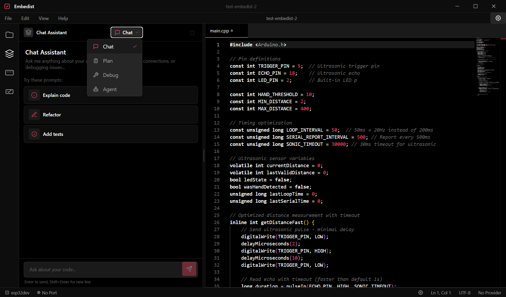
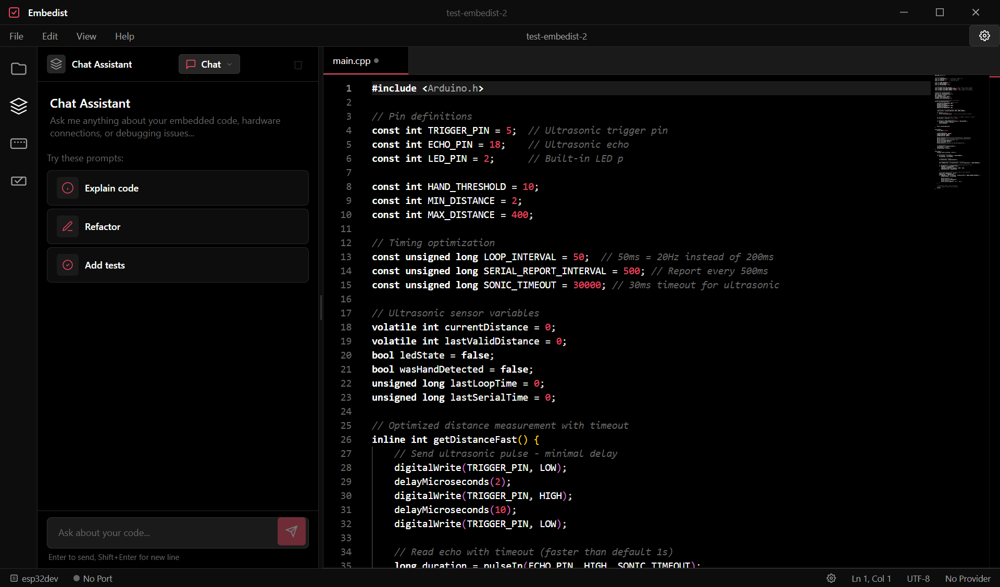
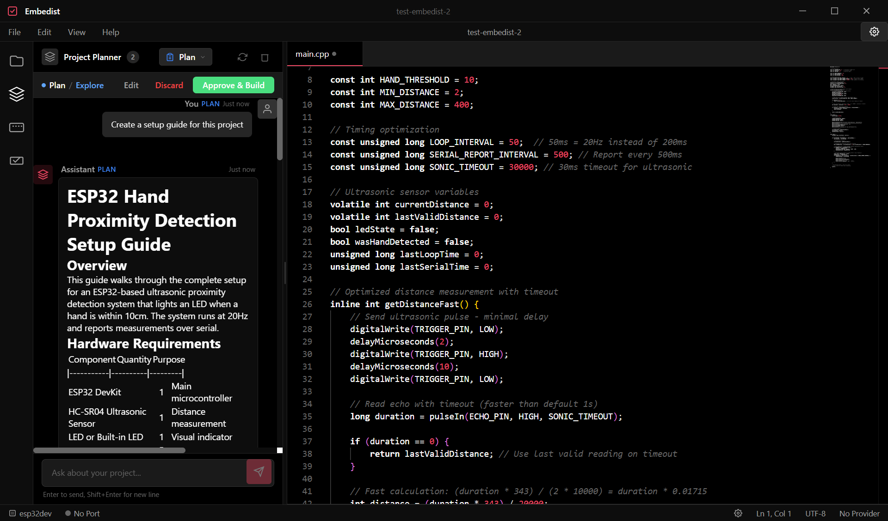
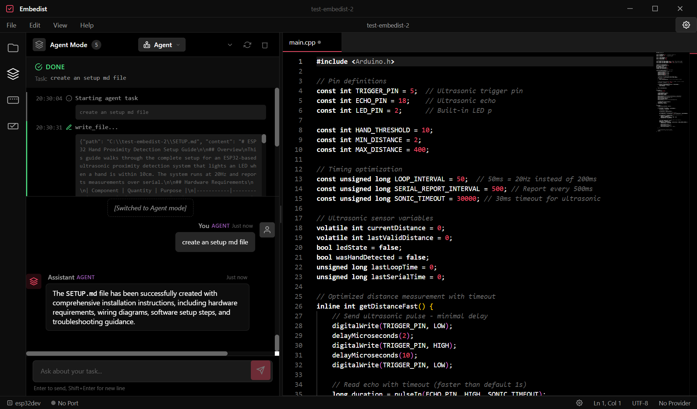
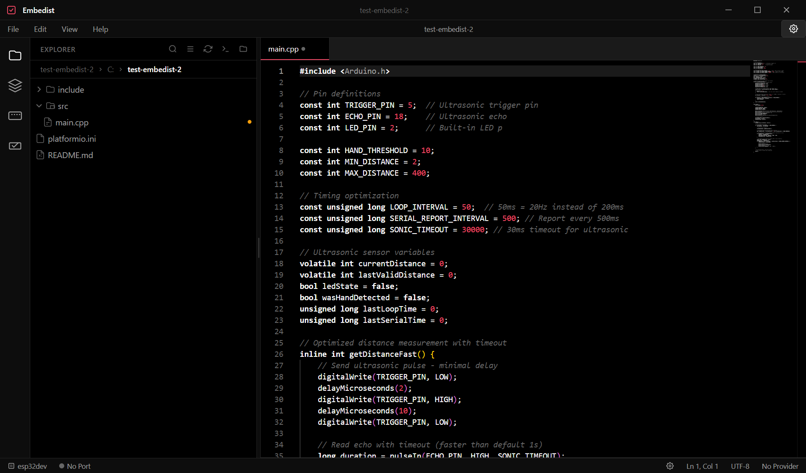

# Embedist

<div align="center">

**AI-Native Embedded Development Environment**

[](LICENSE)
[](https://github.com/mandarwagh9/embedist/stargazers)
[](https://github.com/mandarwagh9/embedist/releases)
[](https://github.com/mandarwagh9/embedist/releases)
[](https://github.com/mandarwagh9/embedist/releases)

</div>

---

## Overview

Embedist is a desktop application that combines AI assistance with embedded firmware development. Built with Tauri 2, React, and TypeScript, it brings board-aware AI debugging, native serial monitoring, and PlatformIO build integration into a single cohesive environment.

Open any project folder — ESP32, Arduino, or any embedded codebase — and get context-aware AI assistance that understands your hardware. Build, upload, monitor serial output, and iterate faster with AI that knows your board.

The current release line ships Windows binaries. This branch adds native serial support and Linux-friendly setup logic so the port added upstream without breaking Windows.

## Screenshots

### AI Modes — Chat, Plan, Agent, and Debug



### Chat Mode — Ask questions, get hardware-aware answers



### Plan Mode — Collaborate on project plans before coding



### Agent Mode — Autonomous code implementation with live activity log



### Default Interface — File Explorer, Serial Monitor, and Monaco Editor



---

## Features

- 🤖 **Multi-Provider AI** — Chat, Plan, Agent, and Debug modes with support for OpenAI, Anthropic, Google, DeepSeek, Ollama, NVIDIA NIM, and custom vLLM endpoints
- 🔍 **Board-Aware Context** — AI debugging uses detected board info (ESP32 Dev Module, Arduino Uno, etc.) for accurate, hardware-specific fixes
- 📡 **Serial Monitor** — Native real-time device communication with configurable baud rates, line endings, and port selection
- 🔨 **Build & Upload** — PlatformIO CLI integration with live output streaming, parsed errors/warnings in a Problems panel, and a Stop Build button
- 📁 **File Explorer** — Context menus (rename, delete, copy path, reveal in explorer), breadcrumbs navigation, Command Palette (Ctrl+Shift+P), Recent Files, inline rename, multi-select
- 📝 **Tab Management** — Multi-tab editing with Monaco Editor, dirty indicators, save/close/pin operations, and keyboard shortcuts
- ⌨️ **Keyboard Shortcuts** — VS Code-style keybindings for all major operations
- 🎨 **Dark Theme** — Professional monochrome design with CSS variables
- ⚡ **Fast & Lightweight** — Tauri 2 Rust backend, ~5.7 MB executable, native performance
- 🧠 **NVIDIA NIM Support** — Thinking mode for advanced reasoning models (e.g., Kimi-K2.5)
- 🔧 **Edit Custom Endpoints** — Modify existing custom AI endpoints
- 🔐 **Persistent API Keys** — Custom endpoint API keys survive app restarts
- 🚀 **Setup Wizard** — First-run guided setup for PlatformIO installation, including Linux-friendly path hints
- 🖥️ **Startup Loading State** — Branded spinner on launch, deferred heavy operations to prevent "not responding"

## Downloads

### Latest Release: v0.37.0

[](https://github.com/mandarwagh9/embedist/releases/download/v0.37.0/embedist.exe)
[](https://github.com/mandarwagh9/embedist/releases/download/v0.37.0/Embedist_0.37.0_x64-setup.exe)

Download the executable and run it directly — no installation required.

Linux release builds are produced as AppImage and `.deb` packages from the same source tree, so the release page can carry both the Windows installer and native Linux bundles.

> **Windows SmartScreen warning?** When you first run the app, Windows may show a blue SmartScreen warning. This is not a virus warning — it's a standard Windows security screen for unsigned applications. Simply click **"More info"** then **"Run anyway"** to launch Embedist.

**[All Releases](https://github.com/mandarwagh9/embedist/releases)** | **[Changelog](CHANGELOG.md)**

---

## Getting Started

### Quick Start

1. Download the release package for your platform from [Releases](https://github.com/mandarwagh9/embedist/releases)
2. Run the application
3. Press `Ctrl+O` or use `File > Open Folder` to open a project directory
4. Configure your AI provider in `Settings` (`Ctrl+,`)
5. Start coding and debugging with AI assistance

Linux builds are packaged as native AppImage and `.deb` artifacts, so you can either download a release package or build from source on your distro.

### Prerequisites

| Requirement | Description |
|-------------|-------------|
| **Windows** | Windows 10/11 (64-bit) |
| **Linux** | Supported in source and packaged as AppImage/.deb |
| **PlatformIO** | Optional — required for build & upload functionality |
| **AI API Key** | Optional — required for AI debugging features |

### Build from Source

```bash
# Clone the repository
git clone https://github.com/mandarwagh9/embedist.git
cd embedist/embedist

# Install frontend dependencies
npm install

# Run in development mode
npm run tauri dev

# Build production executable
npm run tauri build
```

The release binary will be generated under `src-tauri/target/release/` with an OS-specific name. On Windows that is `embedist.exe`. On Linux, Tauri also produces bundle artifacts under `src-tauri/target/release/bundle/appimage/` and `src-tauri/target/release/bundle/deb/`.

On Linux, the same source tree can be built with the Tauri toolchain, but you may need distro-specific system packages for WebView support and serial access permissions before the app can talk to hardware.

### Linux Setup Notes

- If PlatformIO is installed in a non-standard location, set the CLI path in `Settings > Build` to the full path of `pio`.
- If serial ports are visible but cannot be opened, make sure your user has permission to access `/dev/tty*` devices.
- If PlatformIO is not on PATH, the setup wizard can still use the path you configured in settings.

#### Rust Dependencies

```bash
# Install Rust (if not already installed)
curl --proto '=https' --tlsv1.2 -sSf https://sh.rustup.rs | sh

# Run linter
cd src-tauri && cargo clippy
```

---

## Keyboard Shortcuts

| Shortcut | Action |
|----------|--------|
| `Ctrl+O` | Open Folder |
| `Ctrl+S` | Save File |
| `Ctrl+Alt+S` / `Ctrl+K+S` | Save All |
| `Ctrl+W` | Close Tab |
| `Ctrl+B` | Toggle Sidebar |
| `Ctrl+J` | Toggle Bottom Panel |
| `Ctrl+,` | Open Settings |
| `Ctrl+Shift+E` | Focus File Explorer |
| `Ctrl+Shift+X` | Focus AI Assistant |
| `Ctrl+Shift+L` | Focus Serial Monitor |
| `Ctrl+Shift+B` | Focus Build Panel |
| `Ctrl+Shift+P` | Command Palette |
| `Ctrl+1` | AI Chat Mode |
| `Ctrl+2` | AI Plan Mode |
| `Ctrl+3` | AI Agent Mode |
| `Ctrl+4` | AI Debug Mode |
| `Ctrl+Tab` | Cycle Tabs |

---

## Supported Boards

### ESP32 Family
- ESP32 Dev Module
- ESP32 WROOM / WROVER
- ESP32 S3
- ESP32 C3 / C6
- ESP32 CAM
- NodeMCU-32S

### Arduino Family
- Arduino Uno / Nano / Mega
- Arduino Pro Mini
- Arduino Leonardo
- Arduino Due
- Arduino Zero
- ESP8266 (via Arduino framework)

### Other
- Any board supported by PlatformIO

---

## Architecture

Embedist is built on a modern, lightweight stack optimized for performance and developer experience.

| Layer | Technology |
|-------|------------|
| Desktop Framework | [Tauri 2](https://tauri.app/) — native WebView |
| Frontend | React 18 + TypeScript (strict mode) |
| Code Editor | Monaco Editor (VS Code's editor) |
| State Management | Zustand with `localStorage` persistence |
| AI Integration | OpenAI, Anthropic, Google, DeepSeek, Ollama, NVIDIA NIM, vLLM |
| Build System | PlatformIO CLI (`pio`, `pio run`, `pio device monitor`) |
| Serial Communication | Native Rust serial backend |
| Styling | CSS Variables — no framework |

### Directory Structure

```
embedist/
├── src/
│   ├── components/
│   │   ├── AI/          # AIChatPanel, MessageBubble, CodeBlock, MarkdownRenderer,
│   │   │                # StreamingIndicator, FeedbackPanel, AgentActivityPanel,
│   │   │                # PromptSuggestions, PlanToolbar
│   │   ├── Build/       # BuildPanel, ProblemsPanel
│   │   ├── Editor/      # Monaco editor wrapper
│   │   ├── FileExplorer/ # FileExplorer, ContextMenu, Breadcrumbs,
│   │   │                  # CommandPalette, RecentFiles
│   │   ├── Layout/      # Sidebar, MenuBar, StatusBar, TitleBar
│   │   ├── Serial/      # SerialMonitor
│   │   └── Settings/    # Settings panels
│   ├── stores/          # aiStore, fileStore, settingsStore, uiStore
│   ├── hooks/           # useAI, useAgent, useBuild, useFileSystem,
│   │                    # useSerial, usePlanContext
│   ├── lib/             # ai-prompts.ts, rag.ts, agent-tools.ts
│   └── types/           # Shared TypeScript types
├── src-tauri/
│   └── src/
│       ├── commands/    # ai.rs, filesystem.rs, platformio.rs, serial.rs
│       ├── lib.rs       # App entry, plugin init, command registration
│       └── main.rs      # Binary entry
├── AGENTS.md             # Developer guide
└── package.json
```

---

## Known Issues

- Settings toggle for "default implementation mode" is not exposed in the Settings UI
- Windows PTY terminal resize is a no-op due to ConPTY limitations
- Drag-drop files in FileExplorer is a stub

For a detailed list of all changes, see [CHANGELOG.md](CHANGELOG.md).

---

## Contributing

See [AGENTS.md](AGENTS.md) for developer setup, code conventions, build commands, and release process.

---

## Acknowledgments

Thanks to **[Jiya Mehta](https://github.com/JiyaMehta-6)** for brainstorming the concept and helping shape Embedist's vision.

---

## License

MIT License — see [LICENSE](LICENSE) for details.

---

<div align="center">

Made with ❤️ for embedded developers

</div>
